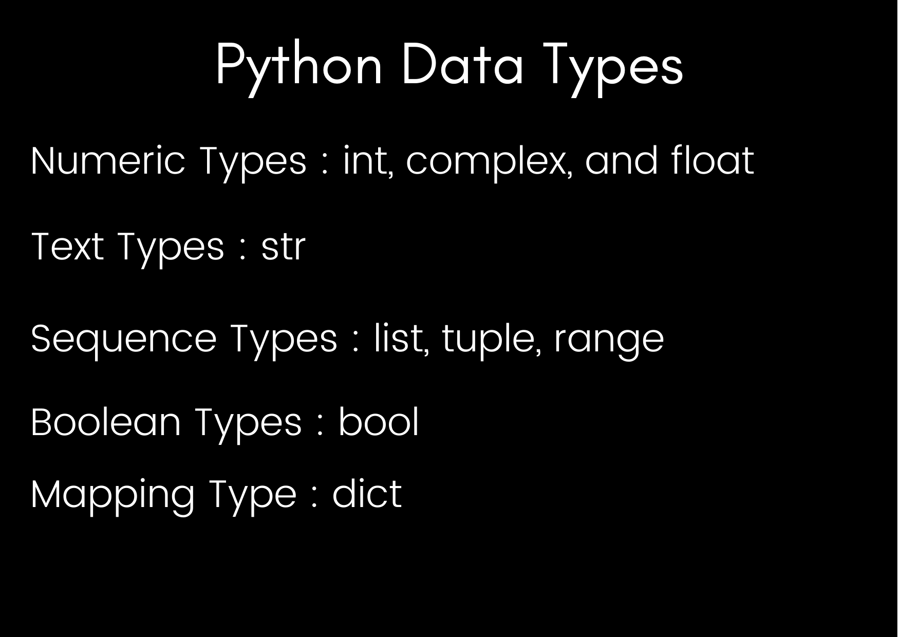

# Time for Data types (Part - 1)
### If you are a programmer already then you will surely know what are Data Types for newbies Data types are different types of "Data" like numbers, text, and etc. In Python we have the following Datatypes :



## So now lets see them in code 👇
## Text Types :
### String or str is nothing but "Text" it can also have numbers but we can not use them to calculate. 
```python
# String
stre = "Hello Guys"
print(stre)
print(type(stre))
```

## Numeric Types
### Integers are the 'integers' which we have in Daily life like 2, 32, 344, -23 and etc. 

> Note - "Remeber we **don't need quotes** like we need in strings"
```python
#Integers
inte = 8747 
print(inte)
print(type(inte)) #To check which type of data type it is
```

### Float are decimal values or scientific values with an "e" to indicate the power of 10.
> Note - "Even if you provide a whole number it will be stored  in decimal value like 83 as 83.0"
```python
#Float
floate = 8747.43
print(floate)
print(type(floate)) #To check which type of data type it is
```
### In Complex values you can put ‘j’ or ‘J’ after a number to make it imaginary. The ‘j’ suffix comes from electrical engineering.
```python
#Compplex
x = 63j
y = 3j
print(x+y)
print(type(x))
```

## Boolean Types
### Boolean values are "True" or "False" values.
### Using them we can determine whether the value is True or False. Lets see them 👇
```python
print(45>30) # Comparing whether 45 is greater than 30.
```

## ***Other Data Types are coming soon!***
## Code File - [Data Types](Python-Scripts\datatypes.py)
## Your Next Lesson - [Data Types Part 2](4-DataTypesPT-2.md)